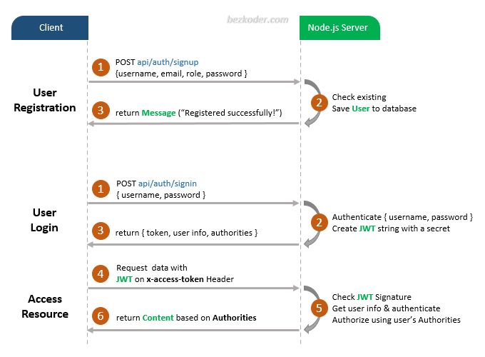

# Node.js – JWT Authentication example with PostgreSQL or MySQL example

## User Registration, User Login and Authorization process.
The diagram shows flow of how we implement User Registration, User Login and Authorization process.




## Project setup
```
npm install
```

Then, edit `app/config/db.config.js` with correct DB credentials.
```
If you use MySQL Database:-
module.exports = {
  HOST: "localhost",
  USER: "USER",
  PASSWORD: "PASSWORD",
  DB: "DB NAME",
  dialect: "mysql",
  pool: {
    max: 5,
    min: 0,
    acquire: 30000,
    idle: 10000
  }
};

OR

module.exports = {
  HOST: "localhost",
  USER: "USER",
  PASSWORD: "PASSWORD",
  DB: "DB NAME",
  dialect: "postgres",
  pool: {
    max: 5,
    min: 0,
    acquire: 30000,
    idle: 10000
  }
};

```

### Run
```
npm run dev
```
